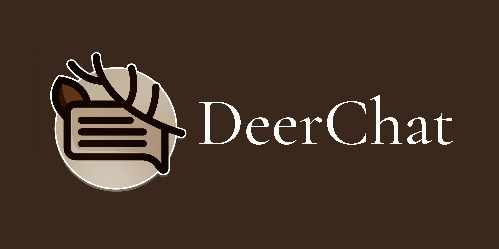

**Motivation**
---
DeerChat is a social media platform for university students that allows them to communicate anonymously through forums. These
forums are based on different topics chosen by users. 

DeerChat removes useless and unnecessary subforums through voting. Each subforum topic is proposed and users vote on which forum they would like to see on DeerChat. This voting system gives users power on what they would like to see on DeerChat.

DeerChat gives university students the ability to communicate, socialize and network with students and professors in their university.

**Installation**
---

__Required tools/programs__

DeerChat is using the MERN stack which is a full-stack technology that is based on the 3-tier architecture.

1. __React (Frontend)__

2. __Express.js and Node.js (Backend)__

   [Install Node.js](https://nodejs.org/en/download/)

3. __MongoDB (Database)__

    For Windows:

    [Install MongoDB](https://www.mongodb.com/try/download/community)

    For MacOs:

    Use homebrew to download MongoDB

    ```brew tap mongodb/brew```

    ```brew install mongodb-community@5.0```


**Contribution**
---
Git flow is used to organize git branching.

__Branches__

The name of branches are main, develop, feature branches.

1. ```Main```
The main/master branch. Code should not be merged into the main/master branch before team review.

2. ```Develop```
The develop branch is where all the testing and code review takes place. All features are merged into the develop
branch.

3. ```Feature```
Feature branch where different features are coded. The branch should contain the name of the feature.


__Ticketing__

DeerChat uses jira as their main ticketing software.

